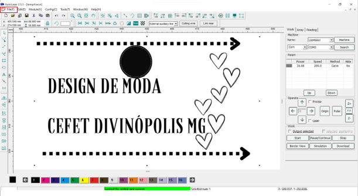
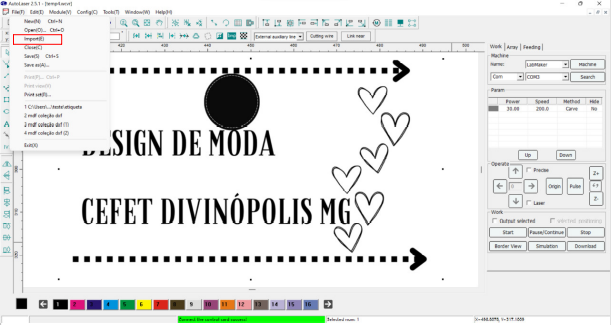
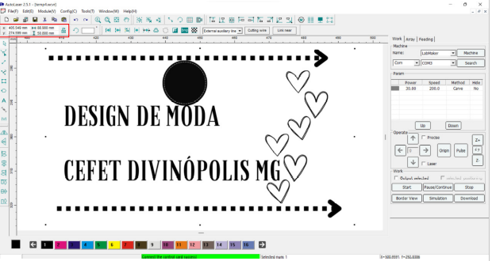
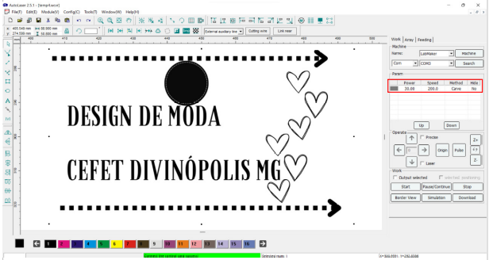
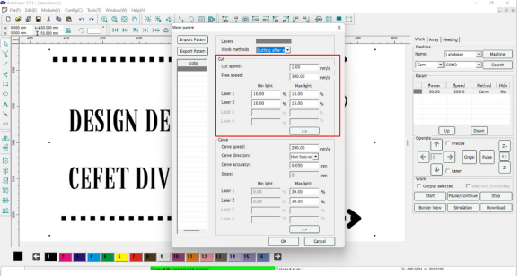
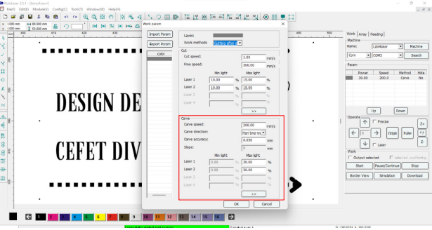
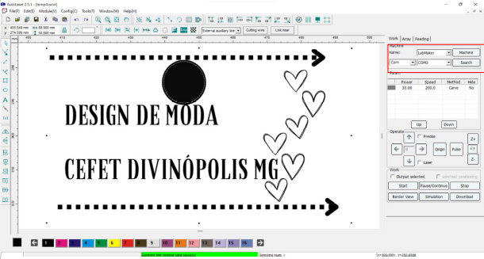

# Cortadora a laser
 
## Cuidados iniciais:

### Equipamento de arrefecimento:

- Primeiro lige o equipamento(você ira escutar um barulho estridente).
- Confira se a luz verde está acesa, caso contrario verifique o nivel da agua.
 > Em caso de nivel baixo solicide a reposição ao departamento de quimica.

### Cortadora a laser :

 - Ligue a cortadora a laser no botão vermelho.
 - Após ligada, posicione o bico no ponto onde você deseja começar a impressão e aperte a origin.
 - Posicione a mesa de impressão a 5mm do material onde vc deseja engravar ou cortar, utilize o molde do laboratorio para ficar na posição exata.

## Utilizando o software:

### Importanto arquivos:

- Ao ligar o software você deve ja estar com o arquivo pronto para o corte, não é recomendado fazer a imagem no softeware.

- Clique em importar e selecione o arquivo que vc deseja imprimir.

- O software aceita os seguinte formatos de arquivos:

### Definindo tamanho:

- O tamanho pode ser redimensionado usando o software, repare que a escala esta em milimetros.

> Todas a dimensões do arquivo não são redefinidas automaticamente, por isso lembre-se de fazer isto manualmente.

### Definindo metodos de engravamento e potencia:

- No incone podemos ver as camadas de impressão.
- Observe que so a uma camada, a de engravamento.
- Para adicionar uma camada de corte é necessario adcionar mais uma camada de corte.

- Ao clicar no box de podemos obeservar algumas caracteristicas de engravamento. Como velocidade do corte(cut speed), potencia do laser para o corte.
 
> Observe que a você selecionara a potencia do laser pela porcentagem. Logo, a potencia vai variar de acordo com o material.

- Logo abaixo dos metodos de corte podemos ver o metodos de engravamento. Definidos por velocidade do engravamento(que pode mudar diretamente a coloração do engravamento), o tipo de engravamento e potencia do laser.

> Novamente a potencia do laser ira variar de acordo com o material, uma potencia muito forte podera cortar o material ao inves de engravar.

### Enviando o arquivo para a CNC:

- Após todos o metodos acima finalizados você ja pode enviar a arquivo para a cnc. 

- Primeiramente você deve definir o tipo de conexão no canto superior direito. 

- Existem dois tipos de conexão, com e network. A conexão 'com' é feita conectando o cabo ao computador e dando o search para localiazr a maquina cnc. 
- Ja a conexão Network não necessita de cabos, porem necessita de conexão com a rede. Logo, se o computador não tiver conectado a rede ou a maquina não estiver esse modo de conexão não funcionara.